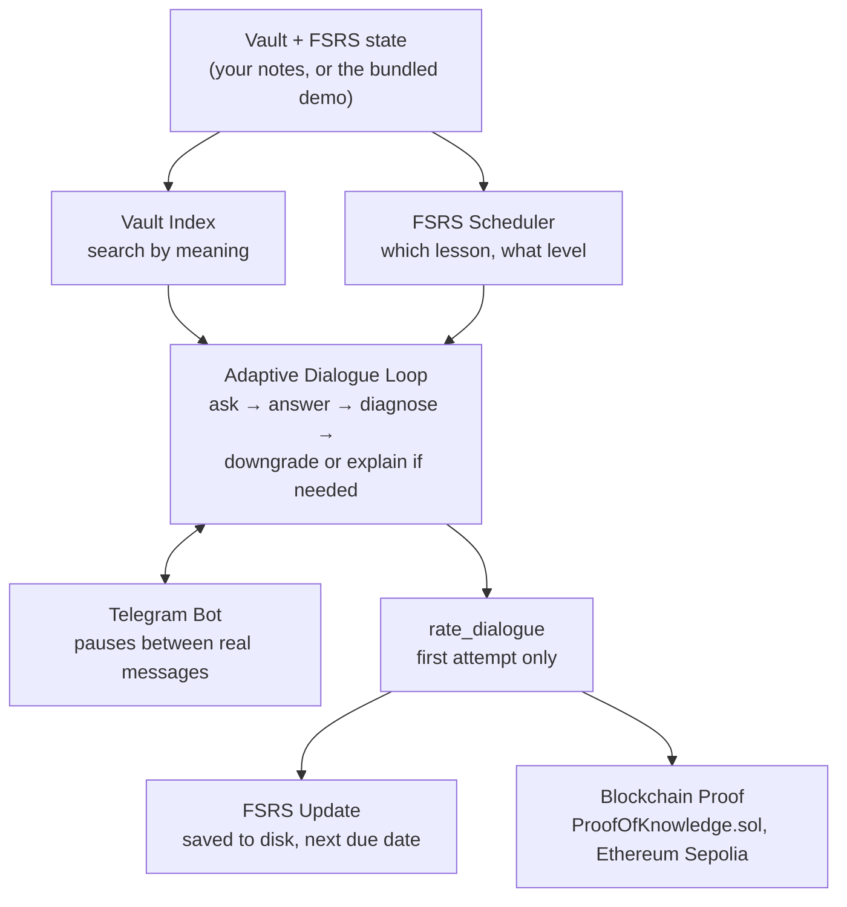

# Smart Repetition Agent

An agentic spaced-repetition tutor that reads your own notes, asks you real questions about them, and *adapts its own next move at runtime* instead of following a fixed script: if your answer is shaky, it drops the difficulty and asks again on the same material before deciding you're done, and if you say you don't know, it teaches the concept properly instead of just marking you wrong. Every session's outcome is scheduled with FSRS and provable on-chain.

## What It Does

```
Your notes → Semantic search finds the right passage → Claude asks one question
    → you answer, or say you don't know → if fuzzy, try again easier; if unsure, get taught
    → the whole dialogue collapses to one honest FSRS rating → proof goes on Ethereum
```

**The problem:** Traditional flashcard apps make you write your own cards, use outdated algorithms, quiz surface-level facts, mark you wrong and move on the instant you're unsure, and can't prove you actually learned anything.

**The solution:** This agent reads your actual notes, finds material by *meaning* rather than filename, generates one question at the difficulty your FSRS history says you've earned, and lets a real decision, made by the model at runtime, choose what happens next: solid answers end the dialogue, shaky ones retry one level easier on the same material, and "I don't know" opens an open-ended teaching conversation that only ends when you say you're ready. It runs as a real Telegram bot where that whole conversation can pause for hours between your replies, and records a cryptographic proof of what you studied on Ethereum.

## Features

- **Semantic vault retrieval** - Finds lesson passages by meaning (local embeddings, no API key), not by matching filenames
- **FSRS spaced repetition** - State-of-the-art scheduling that learns your memory patterns
- **The adaptive dialogue loop** - A LangGraph agent that asks, grades your real answer with Claude, and decides at runtime whether to end the dialogue or retry one level easier - the actual agentic core, not a fixed pipeline
- **"I don't know" teaching mode** - Say so, in your own words, typos and all, and the agent teaches the concept from the ground up for as long as you need, then records the card honestly
- **Pausable, multi-user Telegram bot** - Built on LangGraph's checkpointer, so a real conversation survives a real gap between your replies, and many users' paused dialogues run independently in one process
- **Honest rating policy** - A dialogue that needed retries still records its *first* attempt's score, so an easier retry never inflates what gets scheduled or proven
- **On-chain proof of knowledge** - Review results submitted to a real, deployed `ProofOfKnowledge` contract on Ethereum Sepolia via the oracle pattern
- **Interface-agnostic core** - The same graph drives a terminal demo and the Telegram bot through the identical pause/resume mechanism
- **Bundled demo course** - Try the whole thing without configuring your own Obsidian vault at all

## Project Structure

```
smart-repetition-agent/
├── agent/
│   ├── graph/
│   │   ├── vault_search.py         # LangGraph node: search-by-meaning demo
│   │   ├── ask_question.py         # pick a due lesson → ask one real question
│   │   ├── adaptive_dialogue.py    # the heart: ask/answer/diagnose/downgrade/explain, CLI demo
│   │   └── telegram_dialogue.py    # same loop, wired for an externally-supplied lesson
│   └── src/
│       ├── course_parser/
│       │   ├── parser.py           # reads a vault, extracts content
│       │   └── models.py           # Lesson, Chapter, Course dataclasses
│       ├── retrieval/
│       │   ├── embedder.py         # local embeddings (model2vec), no API key
│       │   └── store.py            # chunk, embed, save, search-by-meaning
│       ├── scheduler/
│       │   ├── review.py           # ReviewItem, SchedulerManager, ReviewSession
│       │   ├── dialogue_rating.py  # collapse a whole dialogue into one FSRS rating
│       │   └── cli.py              # legacy CLI (status/review/stats), pre-agentic
│       └── ai/
│           ├── question_generator.py  # Claude API → quiz questions
│           ├── answer_assessor.py     # Claude API → answer scoring
│           └── prompt_builder.py      # dynamic prompts by consolidation level
├── bot/
│   └── telegram_bot.py             # drives the adaptive graph over real Telegram messages
├── blockchain/
│   └── chain.py                    # BlockchainBridge: signs and submits real proofs
├── contracts/
│   └── src/ProofOfKnowledge.sol    # on-chain review proof storage (deployed to Sepolia)
├── demo/
│   ├── Coffee Science/             # a tiny bundled course, no vault required
│   └── build_demo_data.py          # generates data/demo_courses.json from it
├── data/
│   ├── courses.json                # parsed course structure (yours, once configured)
│   └── review_state.json           # FSRS card states, gitignored (your personal progress)
├── .env.example
├── LICENSE
└── README.md
```

## Try It Without Your Own Vault

A bundled two-lesson course ships in `demo/`, so you can try the whole pipeline immediately:

```bash
python demo/build_demo_data.py
cp data/demo_courses.json data/courses.json
rm -rf data/vault_index   # force a fresh embed over the demo lessons
python agent/graph/adaptive_dialogue.py
```

Type an answer, say "I don't know" to see the teaching mode, or give a shaky answer to see the down-a-rung retry.

## Using Your Own Obsidian Vault

```
Your-Vault/
└── 04 Resources/
    └── Courses/
        └── Your Course Name/
            ├── _course.yaml              # Required: defines structure
            ├── Lesson 01 - Topic.md
            ├── Lesson 02 - Topic.md
            └── ...
```

### `_course.yaml` Format

```yaml
title: "Your Course Title"
description: "Optional description"
chapters:
  - name: "Chapter 1 Name"
    lessons:
      - "Lesson 01 - Topic"      # Must match filename (without .md)
      - "Lesson 02 - Topic"
  - name: "Chapter 2 Name"
    lessons:
      - "Lesson 03 - Topic"
```

### Lesson Frontmatter

Each `.md` file can include optional frontmatter:

```markdown
---
tags: [topic1, topic2]
difficulty: intermediate
estimated_review_minutes: 25
lesson_number: 1
---

# Lesson Content Here
```

## Installation

```bash
git clone https://github.com/dassmod/smart-repetition-agent.git
cd smart-repetition-agent

python3 -m venv .venv
.venv/bin/python -m pip install pyyaml py-fsrs anthropic model2vec numpy \
    python-telegram-bot web3 python-dotenv

cp .env.example .env
# fill in .env with your real ANTHROPIC_API_KEY (required) and, optionally,
# TELEGRAM_BOT_TOKEN / SEPOLIA_RPC_URL / SEPOLIA_PRIVATE_KEY / POK_CONTRACT_ADDRESS

# then either try the bundled demo (see above), or parse your own vault:
cd agent/src/course_parser && python parser.py
```

## Usage

### The adaptive dialogue, as a terminal demo

```bash
python agent/graph/adaptive_dialogue.py
```

Picks whichever real lesson is due, asks one question at the difficulty your FSRS history has earned, and reacts to your real answer: solid ends the dialogue, fuzzy retries one level easier, "I don't know" opens a real teaching conversation.

### The Telegram bot

```bash
export $(grep -v '^#' .env | xargs)
python -m bot.telegram_bot
```

Commands: `/review`, `/status`, `/skip`, `/stop`. The same dialogue loop drives it, paused between your messages via a LangGraph checkpointer, so it survives a real gap between question and reply, however long.

### A sample dialogue

```
📝 Card 1/6 — Level 3/4
📖 Lesson 01 - Decentralized Training Protocols
📂 Foundations of Distributed AI

❓ Why does gradient staleness slow convergence in asynchronous training?
💡 Hint: Think about what happens when workers use outdated parameters.

> not so sure, explain it to me

Alright, let's build this up from the ground...
[a real, multi-turn explanation, styled on your own learning principles]

> ok got it, thanks

🟠 bottomed_out — recorded as 1/4 at level 3/4
```

## How the Adaptive Loop Actually Works

Unlike a fixed quiz script, the next step is a real decision made after seeing your real answer:

| Your answer | What happens |
|---|---|
| Solid (score ≥ 3) | Dialogue ends, recorded at the current level |
| Fuzzy, and a level remains below | Drops one level, asks again on the *same* lesson |
| Fuzzy, already at the floor | Ends, recorded as bottomed out |
| "I don't know" (however phrased, typos included) | Opens an open-ended teaching conversation, ends only when you signal you're ready, recorded as Again |

Your starting difficulty each session comes from FSRS stability - the same card gets asked harder as your memory strengthens:

| Level | Stability | Scope |
|-------|-----------|-------|
| 1 | < 5 days | Single lesson recall |
| 2 | 5-19 days | Why/how reasoning |
| 3 | 20-59 days | Cross-lesson connections |
| 4 | 60+ days | Cross-course synthesis |

A dialogue with retries still gets rated on its **first** attempt only - that's the honest signal of what you knew at the level FSRS believed you were at; easier retries help you leave with something solid, but don't inflate what gets scheduled or proven on-chain.

## Architecture



Off-chain, everything is Python and LangGraph: retrieval, scheduling, the dialogue loop itself. Only the final, honest rating and a hash of what was studied cross onto the chain - the classic oracle pattern, expensive and subjective work stays off-chain, only a small verifiable proof goes on the immutable ledger.

## Why FSRS Over SM-2?

FSRS (Free Spaced Repetition Scheduler) replaced SM-2 as the default in Anki:

| Feature | SM-2 (Anki legacy) | FSRS |
|---------|---------------------|------|
| Efficiency | Baseline | 20-30% fewer reviews |
| Personalization | Fixed intervals | Learns your memory patterns |
| Accuracy | Good | 99.6% superiority in benchmarks |

FSRS uses machine learning to model your individual forgetting curve, scheduling reviews at the optimal moment for retention.

## Tech Stack

| Component | Technology |
|-----------|------------|
| Language | Python 3.14 |
| Agent orchestration | LangGraph (interrupt/checkpointer for pause-and-resume) |
| Semantic retrieval | model2vec (local static embeddings, no API key), numpy (cosine similarity) |
| Spaced repetition | py-fsrs |
| Question generation & grading | Claude API (Anthropic) |
| Telegram interface | python-telegram-bot |
| Blockchain | Solidity, Foundry, Sepolia testnet |
| Bridge | web3.py (oracle pattern) |

## Design Principles

- **Interface-agnostic core** - The exact same graph nodes drive a terminal demo and the Telegram bot; only how a question gets shown and an answer collected differs
- **Agentic, not scripted** - The down-a-rung and explain-mode decisions are made by reading real output at runtime, not branched on in advance
- **Honest signal over inflated scores** - The rating policy protects what FSRS and the chain actually learn about you, even when the conversation took several tries
- **Oracle pattern** - Expensive, subjective AI compute happens off-chain; only a small, verifiable proof goes on-chain
- **Persistence** - FSRS card state and a paused dialogue's full context both survive between sessions

## License

MIT - see [LICENSE](LICENSE).

## Author

Das - Building at the intersection of AI agents and blockchain.
